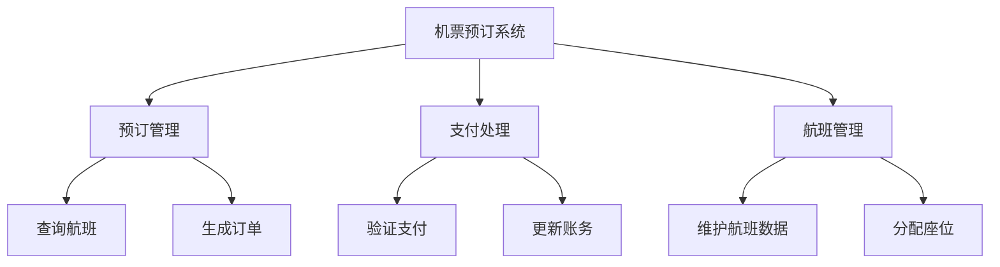

```mermaid
graph TD
    A[机票预订系统] --> B[预订管理]
    A --> C[支付处理]
    A --> D[航班管理]
    B --> B1[查询航班]
    B --> B2[生成订单]
    C --> C1[验证支付]
    C --> C2[更新账务]
    D --> D1[维护航班数据]
    D --> D2[分配座位]

```